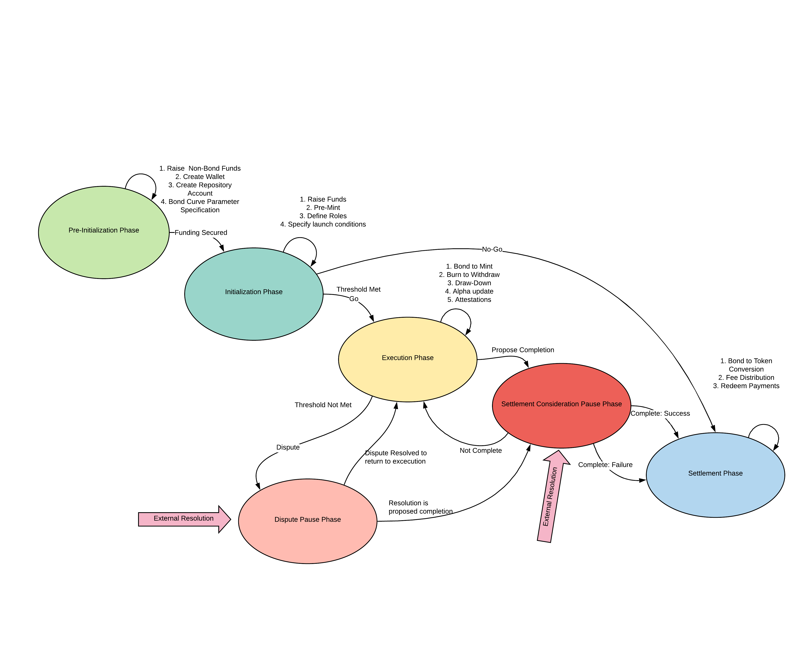

# Bond Lifecycle Phases
The bonding curve system can be described as a finite state machine, with multiple  finite phases or states, inputs and outputs in and out of each state, and state transitions from one state to another in response to an input.

> Note: For simplicity and consistency with modelling and simulation explainers, this document adopts a pseudo-code or protocol-like language.

	
	 

## Phase 0: Pre-initialization 
During the pre-initialization phase, the bond is set up with an associated wallet and repository, bond parameters are initialized for best-fit to the project, the receipients of project funds are set, and all bond participants are identified with digital IDs, public keys, and credentials. The bond also acquires non-bond investment such as resources, materials, and equipment. 

### Transitions into Pre-initialization Phase
Since this is the first state of the bond lifecycle, there are no state transitions into this phase.

### Inputs
1. Amount raised in non-bond funds 
2. Wallet Address
3. Repository Account
4. Bond Curve Parameter

### Next State Outputs
1. Amount secured in non-bond funds

### Transitions out of Pre-initialization Phase
A Funding Secured Event will move the system from the Pre-initialization Phase into the Initialization Phase.

## Phase 1: Initialization
During the Initialization Phase, bond funds are raised, conditions for project launch are specified including ProjectTime, ClaimsSubmitted and Alpha thresholds<a href="glossary.md#note29" id="note29ref">29,31,33</a> , and the bond Alpha is initialized to 0.5.

### Transitions into Initialization Phase
A Funding Secured Event will move the system from the Pre-initialization Phase into the Initialization Phase.

### Inputs
1. Amount required in bond funds 
2. ProjectTime 
3. ClaimsSubmitted 
4. Alpha 

### Next State Outputs
1. Amount raised in bond funds 
2. ProjectTime threshold<a href="glossary.md#note29" id="note29ref">29</a> 
3. ClaimsSubmitted threshold<a href="glossary.md#note31" id="note31ref">31</a> 
4. Alpha threshold<a href="glossary.md#note33" id="note33ref">33</a> 

### Transitions out of Initilization Phase
If Funding Threshold = Go, the system will move from the Initialization Phase to the Execution Phase.

Else if Funding Threshold = No-Go, the system will move from the Initialization Phase to the Settlement Phase.

## Phase 2: Execution
The execution phase is the phase where active bond trading occurs.

### Transitions into Execution Phase
1. Initialization Threshold Triggering Event from Initialization Phase
2. Dispute Resolution Return Event to Execution from Dispute Pause Phase
3. A Not Complete Event from the Settlement Consideration Pause Phase

### Inputs
1. Reserve Funds<a href="glossary.md#note34" id="note34ref">34</a>  to be Deposited
1. Supply Tokens<a href="glossary.md#note35" id="note35ref">35</a>  to be Burned
1. Project Success Attestation Supply Tokens<a href="glossary.md#note36" id="note36ref">36</a> 
1. Project Failure Attestation Supply Tokens<a href="glossary.md#note37" id="note37ref">37</a> 
1. Dispute Claim
1. Settlement Consideration Claim

### Next State Outputs
1. Amount of Supply Tokens Minted
2. Amount of Reserve Funds Withdrawn
2. Amount of Funds to Project
2. Price Update
3. Alpha Update
1. Reserve Ratio<a href="glossary.md#note38" id="note38ref">38</a> Update
1. Project Attestion Token Ratio

### Transitions out of Execution Phase
1. A Dispute Triggering Event will move from the Execution Phase into the Dispute Pause Phase
2. A Propose Completion Event will move from the Execution Phase into the Settlement Consideration Pause Phase

### Initial State
Once the threshold is met during the Initialization Phase, an output set of initial conditions determine the initial state of the Execution Phase. All values are at time t = 0:
1. Time to Complete Execution
2. Reserve Funds raised
3. Supply of Tokens Minted
4. Alpha
5. Project Operating Funds
6. Impact Payers Commitment<a href="glossary.md#note40" id="note40ref">40</a> 
7. Reserve Ratio
8. Price<a href="glossary.md#note39" id="note39ref">39</a>
9. Maximum Reserve Ratio
10. Minimum Reserve Ratio
11. Fund Fee

## Phase 3: Dispute Pause
In the Dispute Pause Phase, disputes issued against the bond will undergo external resolution. During this state, all system activity except those directly involved in dispute resolution is paused.

### Transitions into Dispute Pause Phase
A Dispute Triggering event moves the system from the Execution Phase to the Dispute Pause Phase.

### Inputs
1. Dispute Issued 
2. Funding Threshold
3. Dispute External Resolution

### Next State Outputs
1. Dispute Issued 
2. Dispute Verdict

### Transitions out of Dispute Pause Phase
If Dispute Verdict = return to execution, the system will move from the Dispute Pause Phase back to the Execution Phase.

Else if Dispute Verdict = resolved to completion, the system will move from the Dispute Pause Phase back to the Settlement Consideration Pause Phase.

## Phase 4: Settlement Consideration Pause 
In this phase, the bond is evaluated against the Settlement Conditions<a href="glossary.md#note42" id="note42ref">42</a> for success or failure. Similar to the Dispute Pause Phase, all system activity other than settlement consideration activity is paused during this phase. A detailed view of the Settlement process is shown [here](artifacts/SettlementConsiderationPhase.png).

### Transitions into Settlement Consideration Pause Phase
1. A Propose Completion Event moves the system from the Execution Phase to the Settlement Consideration Pause Phase.
2. If Dispute Verdict = resolved to completion, the system moves from the Dispute Pause Phase back to the Settlement Consideration Phase Phase.

### Inputs
1. Settlement Claim
2. Dispute Verdict
3. Settlement External Resolution

### Next State Outputs
1. Settlement Verdict

### Transitions out of Settlement Consideration Pause Phase
A Completion event moves the system from the Settlement Consideration Pause Phase to the Settlement Phase

## Phase 5: Settlement
During the Settlement Phase, Bond Tokens are converted into a compatible form and are distributed to the participants in the bond.

### Transitions into Settlement Phase
A Completion event moves the system from the Settlement Consideration Pause Phase to the Settlement Phase

### Inputs
1. Bond to Token Conversion
2. Payments to be redeeemed
3. Outcomes Payees
4. Outcomes Payments 

### Next State Outputs
1. Fee Distribution
2. Impact Token Distribution
3. Outcomes Payment Distribution

### Transitions out of Settlement Phase
This is the last phase of the system, thus there are no outward state transitions. 

Continue reading Chapter 3: [Engineering Requirements](3_EngineeringRequirements.md)
